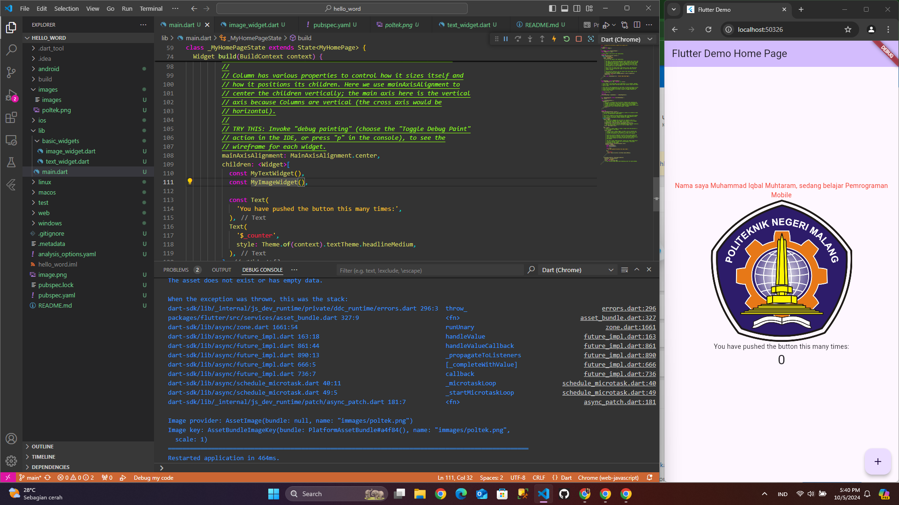
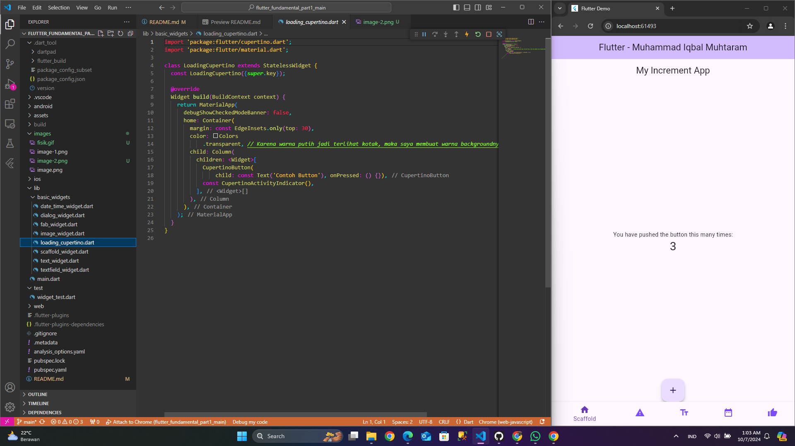
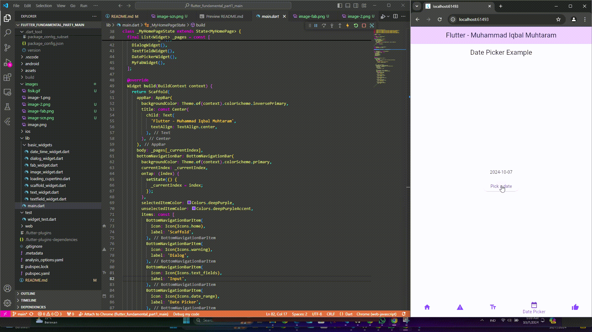
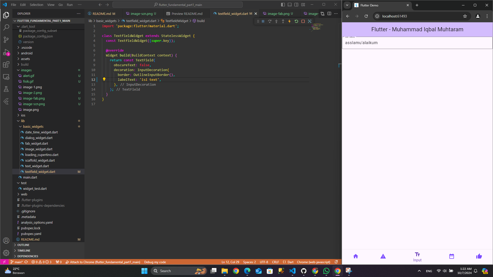

# hello_world

A new Flutter project.

# Praktikum 1 - Buat projek

![alt text][D:\semester 5\flutter_fundamental_part1_main\images\image.png]

# Praktikum 2 - Jalankan di Perangkat fisik

saya menggunakan scrcpy untuk menampilkan di laptop kemudian menggunakan wireless debugging

# Praktikum 4 - Terapkan widget dasar

_Text widget_

Membuat text dengan menggunakan Text() kemudian style diatur dengan menggunakan TextStyle selanjutnya align di atur dengan TextAlign

_Image Widget_

Menampilkan gambar menggunakan AssetImage, gambar di daftarkan terlebih dahulu pada pubspec.yaml

# Praktikum 5 - Terapkan Cupercino Button dan Loading Bar

Menampilkan CupertinoButton() yaitu Sebuah tombol dengan teks "Contoh button". Ketika ditekan, tidak ada aksi karena fungsi onPressed kosong dan
CupertinoActivityIndicator() yaitu Sebuah indikator aktivitas (seperti loading spinner) yang terus berputar

# Praktikum 5 - FAB

Membuat sebuah floating action button dengan floatingActionButton: FloatingActionButton() {}

# Praktikum 5 - Scaffold

Digunakan Scaffold untuk menampilkan bilah aplikasi (appBar), konten utama (body), bilah navigasi bawah (bottomNavigationBar), dan tombol aksi mengambang (floatingActionButton) yang terletak di tengah bawah. Scaffold memudahkan pengaturan tata letak aplikasi dengan elemen-elemen umum seperti ini.

# Praktikum 5 - Alert

Menampilkan tombol dengan teks "Show alert". Ketika tombol ditekan, fungsi showAlertDialog dipanggil, yang memunculkan dialog peringatan (AlertDialog) dengan judul, pesan, dan tombol "OK" untuk menutup dialog.

# Praktikum 5 - Input

Menampilkan TextField dengan teks label "Nama" dan batas berbentuk garis (OutlineInputBorder). Properti obscureText disetel ke `false, sehingga teks yang dimasukkan terlihat jelas (tidak tersembunyi).

# Praktikum 5 - Date Time

Menampilkan tombol "Pilih Tanggal" yang, saat ditekan, memunculkan DatePicker. Pengguna dapat memilih tanggal antara tahun 2015 hingga 2101. Setelah dipilih, tanggal disimpan dalam variabel selectedDate dan ditampilkan di layar

# TUGAS

Pada praktikum 4 mulai dari Langkah 3 sampai 6, buatlah file widget tersendiri di folder basic_widgets, kemudian pada file main.dart cukup melakukan import widget sesuai masing-masing langkah tersebut!

- Pada Emulator
  

- Device Fisik
  

[D:\semester 5\flutter_fundamental_part1_main\images\image.png]: images/image.png